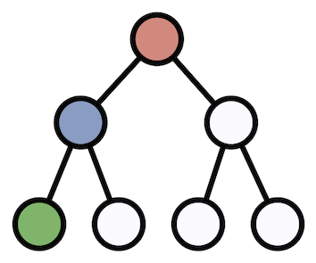

LCAStar: an entropy-based measure for taxonomic assignment within assembled metagenomes
=======

Niels W. Hanson, Kishori M. Konwar, Steven J. Hallam



## Abstract

A perennial problem in the analyses of large meta'omic datasets is the taxonomic classification of unknown reads or assembled contigs to their likely taxa of origin. Although the assembly of metagenomic samples has its difficulties, once contigs are found it is often important to classify them to a taxonomy based on their ORF annotations. The popular Lowest Common Ancestor (LCA) algorithm addresses a similar problem with ORF annotations, and it is intuitive to apply the same taxonomic annotation procedure to the annotation of contigs, a procedure we call LCA2. Inspired by Information and Voting Theory we developed an alternative statistics LCA\* by viewing the taxonomic classification problem as an election among the different taxonomic annotations, and gen- eralize an algorithm to obtain a sufficiently strong majority α-majority while respecting the entropy of the taxonomic distribution and phylogeny tree-structure of the NCBI Taxonomic Database. Further, using results from order and supremacy statistics, we formulate a likelihood-ratio hypothesis test and p-value for testing the supremacy of the final reported taxonomy. In simulated metage- nomic config experiments, we emperically demonstrate that voting-based methods, majority vote and LCA\*, are significantly more accurate than LCA2, and that in many cases LCA\* is superior to the simple majority vote procedure. LCA\* and its statistical tests have been implemented as a stand-alone Python library, and have been integrated into the latest release of the [MetaPathways pipeline](https://github.com/hallamlab/metapathways2).

## Installation

LCA\* is released as as a Python library on [anaconda](https://www.anaconda.com/download)

```bash
conda install -c hallamlab lcastar
```

## Usage

```python
from lcastar import LcaStar, Lineage
```

### *with scientific name (genus species)*
```python
orf_hits = [
    "Muribaculaceae bacterium",
    "Muribaculaceae bacterium",
    "Bacteroidales bacterium",
    "Muribaculaceae bacterium",
    "Alistipes senegalensis",
]

tree = LcaStar()
for sci_name in orf_hits:
    lin = Lineage.FromSciName(sci_name)
    assert lin is not None
    tree.NewObservation(lin)

for node in tree.BestLineage():
    print(node.level, node.name, node.fraction_votes, node.p_value)
```

### *with NCBI taxonomy ID*
```python
orf_hits = [
    2498093,
    2498093,
    2030927,
    2498093,
    1288121,
]

tree = LcaStar()
for tax_id in orf_hits:
    lin = Lineage.FromTaxID(tax_id)
    assert lin is not None
    tree.NewObservation(lin)
```

### *output:*
```python
for node in tree.BestLineage():
    print(node.level, node.name, node.fraction_votes, node.p_value, )
```
```
superkingdom Bacteria 1.0 0.08273697918531309
clade FCB group 1.0 0.08273697918531309
clade Bacteroidota/Chlorobiota group 1.0 0.08273697918531309
phylum Bacteroidota 1.0 0.08273697918531309
class Bacteroidia 1.0 0.08273697918531309
order Bacteroidales 1.0 0.08273697918531309
species Bacteroidales bacterium 0.2 1.0
```

## TODO:
* wait for [ete4](https://github.com/etetoolkit/ete) to be released on conda for python>=3.11 and switch over from pip
