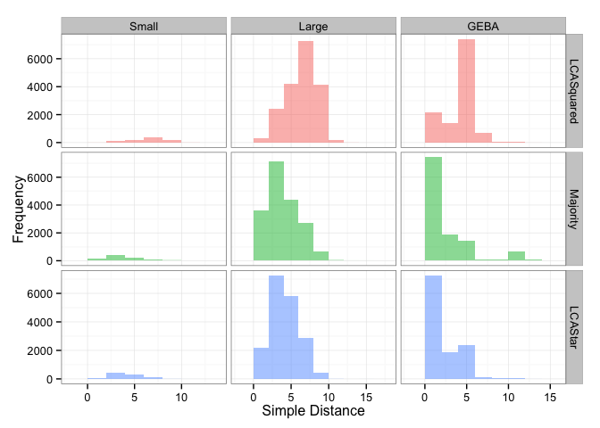
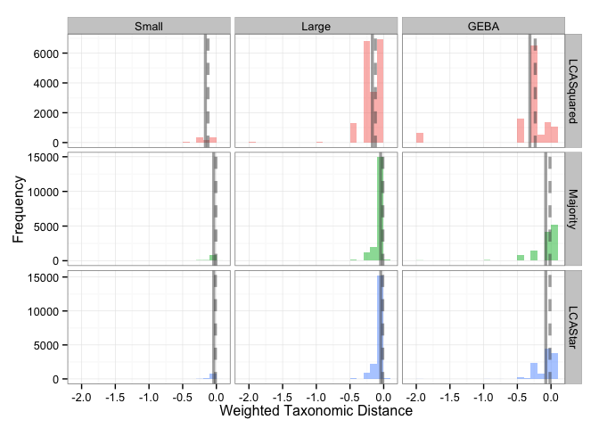
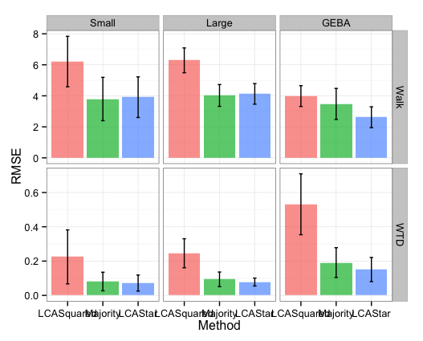
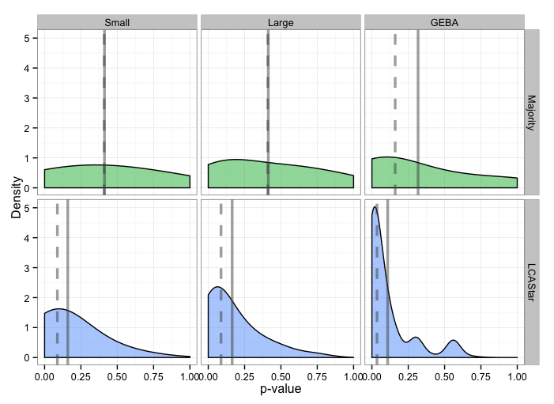

# LCA Star Supplementary Code
Niels W. Hanson, Kishori M. Konwar, Steven J. Hallam  
Wednesday, May 20, 2015  


# Preample

* Load required R packages


```r
require(ggplot2)
require(reshape2)
require(dplyr)
```

* Set plotting theme


```r
theme_set(theme_bw())
```

# Overview

This document summarizes the analysis performed in "LCA*: an entropy-based measure for taxonomic assignment within assembled metagenomes", describing ths construction of the Small and Large metagenomes from a coolection of genomes downloaded from the NCBI, the running of the MetaPathways pipeline [[@Konwar:2013cw], [@Hanson2014]], use of the `LCAStar.py` Python library for the calculation of the $LCAStar$, $Simple Majority$, $LCA^2$ taxonomic estimates for assembled metagenomic contigs.

Each simulation was run through the MetaPathways v2.0 pipeline [[@Hanson2014]], having its ORFs predicted and annotated against the RefSeq database using standard settings (Version 62, BSR=0.4, E-value=1e-5, Bit-score=20) [[@Pruitt:2007fi]]. Taxonomy for each ORF was annotated using the Lowest Common Ancestor (LCA) (or Best-BLAST in the GEBA SAGs), and contig taxonomy was predicted using three different methods: LCASquared, Simple Majority, and our information-theoretic LCAStar. LCASquared simply applies the LCA method again to the set of taxonomic ORF annotations on a contig. Simple Majority ascribes the taxonomy of the contig to the taxonomy that has the greatest number of annotations. Our LCA* method applies our information-theoetic result and algorithm previously described with a the default majority theshold ($\alpha=0.51$).

We evaluated the performance of these predictions using two taxonomic distances on the NCBI taxonomic database hierarchy (NCBI Tree) [[@Federhen:2012jx]]. The first is a Simple Walk of the the NCBI Tree from the observed predicted taxonomy to the original expected taxonomy. The second is a weighted taxonomic distance (WTD) that weightes each edge proportional to $\frac{1}{d}$ where $d$ is the depth of the edge in the tree (see [[@Hanson:2014bz], [@Konwar:2015vh]]) for more details. The NCBI Tree was slightly modified with the addition of a *prokaryotes* node as a parent of *Bacteria* and *Archaea* nodes.

## Materials and Downloads

Up-to-date code is available on the [GitHub repository](https://github.com/hallamlab/lcastar). Data required for this analysis can be found: [lca_star_data.zip](https://www.dropbox.com/s/ew5v55eroa332mu/lca_star_data.zip?dl=0)

# Simulations

Two simulated metagenomes, Small and Large, were created by randomly sampling 10,000bp `contigs' from a collection of 2617 genomes obtained from the NCBI (Downloaded March 15 2014 <ftp://ftp.ncbi.nlm.nih.gov/pub/taxonomy/>) using the Python script [subsample_ncbi.py](../python_resources/subsample_ncbi.py). The first simulation, Small, is a smaller sample of 100 genomes, sampling 10 random reads from each genome. The second simulation, Large, samples a random subset of 2,000 genomes, sampling 10 random reads from each genome.

## Obtaining NCBI Genomes

* Downloaded `all.fna.tar.gz` and `summary.txt` from the NCBI's ftp server: <ftp://ftp.ncbi.nlm.nih.gov/genomes/> Mar 12, 2014
* The file `summary.txt` contains some metadata for a number of these genomes:

```
Accession  GenbankAcc  Length	Taxid	ProjectID	TaxName	Replicon	Create Date	Update_Date
NC_000907.1	L42023.1	1830138	71421	57771	Haemophilus influenzae Rd KW20	chromosome 	Oct 19 2001	Sep 11 2013  4:30:20:076PM
```

* Extract NCBI IDs

```
cat summary.txt  | awk '{print $1}' > u
for s in `cat u`; do var1=`find . -name *${s%.[0-9]}*`; echo $s$'\t'$var1 >> ncbiID_to_file; done
```

* `summary.txt` is a fairly comprehensive list, but 25 genomes were dropped because they were not found in the `summary.txt` metadata file

```
grep --perl-regexp "\t$" ncbiID_to_file | wc
      25      25     324
grep --perl-regexp "\t$" ncbiID_to_file | wc
NC_003911.11  
AC_000091.1	
NC_009353.1	
NC_009444.1	
NC_010332.1	
NS_000190.1	
NC_011980.1	
NS_000196.1	
NS_000197.2	
NC_012627.1	
NC_012629.1	
NC_012630.1	
NC_012915.1	
NC_013416.1	
NC_013438.1	
NC_013597.1	
NC_013784.1	
NC_013785.1	
NC_013786.1	
NC_013787.1	
NC_013788.1	
NC_014629.1	
NC_015557.1	
NC_015587.1
```

* This leaves a total of 2617 genomes in `ncbiID_to_file.txt`, which maps the NCBI IDs to the .fna file location

```
grep --perl-regexp ".*fna" ncbiID_to_file | wc
    2617    5234  197129
wc ncbiID_to_file
    2642    5259  197453 ncbiID_to_file
grep --perl-regexp ".*fna" ncbiID_to_file > ncbiID_to_file.txt
```

## Simulation

The script [subsample_ncbi.py](../python_resources/subsample_ncbi.py) was used to quickly sample from a collection of fasta files specified in our `ncbiID_to_file.txt`. This script creates the `test1` or Small and the `test2` or Large simulated metagenomes.

### Small simulation

Here we create the `test1` (or Small simulation as it is referred to in the text). This script creates sub-sequences of length 10,000, sampling 10 sequences per file on a random subset of 100 (the random number generator is seeded so that results can be reproducible)

```
python subsample_ncbi.py -i ncbiID_to_file.txt -l 10000 -s 10 -n 100 -o lca_star_test1.fasta
```

Creating our Small simulated contigs file: `lca_star_test1.fasta`

### Large simulation

For a second test we sampled sequences of 10,000 bps using 10 subsamples from 2,000 randomly selected genomes. Here, did the same procedure except with significantly more samples.

```
python subsample_ncbi.py -i ncbiID_to_file.txt -o lca_test2.fasta -l 10000 -s 10 -n 2000
```

Creating our Large simulated contigs file: `lca_star_test2.fasta`

# GEBA SAGs

The 201 Single-cell amplified genome (SAG) microbial 'dark matter' assembies were obtained from <https://img.jgi.doe.gov> under the Study Name `GEBA-MDM` [[@Rinke:2013bt]]. Combined assemblies were excluded from this analysis.

# MetaPathways Annotation

The Small, Large, and 201 MDM SAG assemblies were annotated against the RefSeq v62 via MetaPathways v2.0 pipeline [[@Hanson2014]] using standard quality control settings and the LAST homology-search algorithm [[@Kieibasa:2011do]].

* In the MetaPathways base directory:

```
source MetaPathwaysrc 
python MetaPathways.py -i lca_star_data/mp_data/lca_star_simulations/mp_in/lca_star_test1.fasta -o lca_star_data/mp_data/lca_star_simulations/mp_out/ -p lca_star_data/mp_data/lca_star_simulations/mp_in/lca_star_test1_param.txt -v
python MetaPathways.py -i lca_star_data/mp_data/lca_star_simulations/mp_in/lca_star_test2.fasta -o lca_star_data/mp_data/lca_star_simulations/mp_out/ -p lca_star_data/mp_data/lca_star_simulations/mp_in/lca_star_test2_param.txt -v 
python MetaPathways.py -i lca_star_data/mp_data/mdm_sag_assemblies/mp_in/ -o lca_star_data/mp_data/mdm_sag_assemblies/mp_out/ -p lca_star_data/mp_data/mdm_sag_assemblies/mp_in/GEBA_param.txt -v 
```

# Running LCAStar

The script [run_lca_star_analysis.sh](run_lca_star_analysis.sh) runs the Small, Larger, and MDM SAG contigs through the pipeline 

* Note: base paths may need to be updated

The outputs of these runs can be found in [lca_star_data.zip](https://www.dropbox.com/s/ew5v55eroa332mu/lca_star_data.zip?dl=0):

* `test1_lcastar.txt`: LCAStar output for the Small simulation
* `test2_lcastar.txt`: LCAStar output for the Large simulation
* `GEBA_SAG_all_lcastar.txt`: LCAStar output for the 201 GEBA SAGs

# Analysis of LCAStar Results

* Read and merge the three datasets


```r
colClasses <- c("character", "character", "numeric", "numeric", "numeric",
                "character", "numeric", "numeric", "numeric", 
                "character", "numeric", "numeric", "character" )
test1_df <- read.table("lca_star_results/test1_lcastar.txt", sep="\t", header=T, na.strings = "None", 
                      colClasses = colClasses, strip.white=TRUE, quote="")
test2_df <- read.table("lca_star_results/test2_lcastar.txt", sep="\t", header=T, na.strings = "None", 
                      colClasses = colClasses, strip.white=TRUE, quote="")
geba_df <- read.table("lca_star_results/GEBA_SAG_all_lcastar.txt", sep="\t", header=T, na.strings = "None", 
                      colClasses = colClasses, strip.white=TRUE, quote="")

all_df <- rbind(cbind(geba_df, Sample="GEBA MDM"),cbind(test1_df, Sample="Small"),cbind(test2_df, Sample="Large"))

all_df$Sample <- factor(all_df$Sample, levels=c("Small", "Large", "GEBA MDM"))
```

* Compare p-value calculations between the Majority and LCA* methods


```r
# p-value compare
g1 <- ggplot(all_df, aes(x=LCAStar_p, y=Majority_p)) 
g1 <- g1 + geom_point(data = subset(all_df, LCAStar_p > Majority_p), color="#1BB840")
g1 <- g1 + geom_point(data = subset(all_df, LCAStar_p < Majority_p), color="#649EFC")
g1 <- g1 + geom_point(data = subset(all_df, LCAStar_p == Majority_p), color="darkgrey")
g1 <- g1 + xlim(0,1)
g1 <- g1 + ylim(0,1)
g1 <- g1 + xlab("p-value (LCA*)")
g1 <- g1 + ylab("p-value (Majority)")
g1 <- g1 + facet_wrap(~ Sample)
g1 <- g1 + theme(legend.position="none")
g1
```

 

```r
pdf(file = "pdfs/fig1.pdf", width = 10.2, height=3.65)
g1
dev.off()
```

```
## quartz_off_screen 
##                 2
```

**Figure 1:** Comparing p-values of taxonomic voting statistics Majority and LCA*.

Notes:

* All three samples exhibit the general distribution pattern, suggesting that the simulation procecture is producing representative results at least in terms of the LCA* and Majority summary statistics 
* In many cases the simple Majority and LCA* solutions are the same, many values are along a perfect diagonal
* When LCA* and simple Majority disagree, LCA* has more favorable (lower) p-values than the simple majority and in many cases the p-value of the LCA* solution is significantly smaller than the simple Majority one
* Disagreements where $p_{Majority} < p_{LCA^*}$ occur when the LCA* transformation widens the difference between the first and second place leaders (this is a bit of a corner case and happens infrequently)
* The Majority method has a degenerate case where there is as tie in the $M = X_n$ meaning that the Simple majority had to make an arbitary choise between two or more taxonomic candidates
* Results suggest that according to p-value LCA* produces more reliable results

Function to format and reshape data for ggplot:


```r
clean_up_data2 <- function(df) {
  new_df <-rbind(cbind(df$Contig, df$LCAStar, "LCAStar", df$Original, df$LCAStar_p, df$LCAStar_dist, df$LCAStar_WTD),
           cbind(df$Contig, df$Majority, "Majority", df$Original, df$Majority_p, df$Majority_dist, df$Majority_WTD),
           cbind(df$Contig, df$LCASquared, "LCASquared", df$Original, NA, df$LCASquared_dist, df$LCASquared_WTD))
  new_df <- as.data.frame(new_df)
  colnames(new_df) <- c("Contig", "Taxonomy", "Method", "Original", "p-value", "Walk", "WTD")
  new_df.m<- melt(new_df, id.vars = c("Contig", "Taxonomy", "Method", "Original"))
  new_df.m$value <- as.numeric(as.character(new_df.m$value))
  new_df.m$Method <- factor(new_df.m$Method, levels = c("LCASquared", "Majority", "LCAStar"))
  new_df.m
}
```

* Reshape data into ggplot form


```r
test1_df.m <- clean_up_data2(test1_df)
test1_df.m<- cbind(test1_df.m, Sample="Small")
test2_df.m <- clean_up_data2(test2_df)
test2_df.m <- cbind(test2_df.m, Sample="Large")
geba_df.m <- clean_up_data2(geba_df)
geba_df.m <- cbind(geba_df.m, Sample="GEBA MDM")

all_df.m <- rbind(test1_df.m, test2_df.m, geba_df.m)
```

* Plot the distribution of distances between predictions and taxonomic origin


```r
# plotting parameters
my_line_col = "#4C4C4C"
line_size = 1.2
alpha_val = 0.5

walk_means <- select(all_df.m, Method, Sample, variable, value) %>%
  group_by(Method, Sample, variable) %>%
  filter(variable== "Walk") %>%
  summarize(mean=mean(value, na.rm = T),
            percent_25 = quantile(value, probs = 0.25, na.rm = T),
            median = quantile(value, probs=0.5, na.rm = T),
            percent_75 = quantile(value, probs = 0.75, na.rm = T))

g2 <- ggplot(subset(all_df.m, variable == "Walk"), aes(x=value, fill=Method))
# g2 <- g2 + geom_histogram(binwidth=2, alpha=0.8) 
g2 <- g2 + geom_density(adjust=5, alpha=alpha_val) 
g2 <- g2 + facet_grid(Method ~ Sample, scales = "free_x")
g2 <- g2 + theme(legend.position="none")
g2 <- g2 + geom_vline(aes(xintercept=mean), colour=my_line_col, size=line_size, alpha=alpha_val, walk_means)
g2 <- g2 + geom_vline(aes(xintercept=median), colour=my_line_col, linetype="dashed", size=line_size, alpha=alpha_val, walk_means)
g2 <- g2 + xlab("Simple-walk Distance")
g2 <- g2 + ylab("Density")
g2
```

 

```r
pdf(file = "pdfs/fig2.pdf", width = 7, height=7)
g2
dev.off()
```

```
## quartz_off_screen 
##                 2
```

**Figure 2:** Distribution of simple-walk distances of taxonomic predictions to contig origin: LCASquared, Majority, LCA*. Kernel densities for error distances from each of the three prediction methods on the two simluated and GEBA datasets.

Notes:

* In all cases, LCASquared perfomed on-aggregate more poorly than the voting-based methods, Majority and LCAStar.
   * Means and Medians of predicted distances for LCASqared were consistently larger
* LCA* and Majority by large performed very simmialrly in terms of distance from the target taxon, in fact in many cases they are one and the same when no entropy-based transformations need to occur
   * Majority method has a slightly longer tail in the GEBA sample
   * medians are identical in all samples, better measure in slightly skewed distribution
* Simple-walk distance is a crude measure of taxonomic distance


Same thing again, expect using the weighted taxonomic distance.


```r
means <- select(all_df.m, Method, Sample, variable, value) %>%
  group_by(Method, Sample, variable) %>%
  filter(variable== "WTD") %>%
  summarize(mean=mean(value, na.rm = T),
            percent_25 = quantile(value, probs = 0.25, na.rm = T),
            median = quantile(value, probs=0.5, na.rm = T),
            percent_75 = quantile(value, probs = 0.75, na.rm = T))

g3 <- ggplot(subset(all_df.m, variable == "WTD"), aes(x=value, fill=Method))
g3 <- g3 + geom_density(adjust=20, alpha=0.6) 
g3 <- g3 + facet_grid(Method ~ Sample, scales = "free_y")
g3 <- g3 + theme(legend.position="none")
g3 <- g3 + geom_vline(aes(xintercept=mean), colour=my_line_col, size=1.5, alpha=0.5, means)
g3 <- g3 + geom_vline(aes(xintercept=median), colour=my_line_col, linetype="dashed", size=1.5, alpha=0.5, means)
g3 <- g3 + xlab("Weighted Taxonomic Distance")
g3 <- g3 + ylab("Density")
g3
```

 

```r
pdf(file = "pdfs/fig3.pdf", width = 7, height=7)
g3
dev.off()
```

```
## quartz_off_screen 
##                 2
```

**Figure 3:** Distribution of WTD distances of taxonomic predictions to contig origin: LCASquared, Majority, LCA*. Kernel densities for error distances from each of the three prediction methods on the two simluated and GEBA datasets.

Notes:

* Distance punishes divergent predictions more than in-lineage predictions
* LCA* and Majority methods again consistently performed better than LCASquared, although difference is not as extreme as by definition LCASquared will have to predict a common ancestor to all electorate
* LCASquared occassionally has an exetremely large tail of 'root' predictions
* Voting based methods have essentially identical median and average
    * Majority in GEBA sample has slightly shorter tail

Treating the whole thing as a regression problem we have the following RMSE values


```r
# function for RMSE
rmse <- function(x) {
  sqrt(mean(x^2, na.rm = T))
}

ci <- function(x, sig=0.05) {
  
  x <- x[!is.na(x)] # remove NA
  x <- x^2 # squre
  N <- length(x)
  x_sd <- sd(x, na.rm=TRUE)
  
  x_se <- x_sd / sqrt(N)
  x_se <- sqrt(x_se)
  ciMult <- qt((1-sig)/2 + .5, N-1)
  x_ci <- x_se * ciMult
  x_ci
}

# function to compute standard errors
summarySE <- function(data=NULL, measurevar, groupvars=NULL, na.rm=FALSE,
                      conf.interval=.95, .drop=TRUE) {
    require(plyr)

    # New version of length which can handle NA's: if na.rm==T, don't count them
    length2 <- function (x, na.rm=FALSE) {
        if (na.rm) sum(!is.na(x))
        else       length(x)
    }

    # This does the summary. For each group's data frame, return a vector with
    # N, mean, and sd
    datac <- ddply(data, groupvars, .drop=.drop,
      .fun = function(xx, col) {
        c(N    = length2(xx[[col]], na.rm=na.rm),
          mean = mean   (xx[[col]], na.rm=na.rm),
          sd   = sd     (xx[[col]], na.rm=na.rm)
        )
      },
      measurevar
    )

    # Rename the "mean" column    
    datac <- rename(datac, c("mean" = measurevar))

    datac$se <- datac$sd / sqrt(datac$N)  # Calculate standard error of the mean

    # Confidence interval multiplier for standard error
    # Calculate t-statistic for confidence interval: 
    # e.g., if conf.interval is .95, use .975 (above/below), and use df=N-1
    ciMult <- qt(conf.interval/2 + .5, datac$N-1)
    datac$ci <- datac$se * ciMult

    return(datac)
}

res <- select(all_df.m, Method, Sample, variable, value) %>%
       filter(variable %in% c("Walk", "WTD")) %>%
       group_by(Method, Sample, variable) %>%
       summarize(n_obs = n(), RMSE = rmse(value), sd=sd(value, na.rm=TRUE),ci=ci(value, sig=0.05), na.rm=TRUE)
g4 <- ggplot(res, aes(y=RMSE, x =Method, fill=Method)) 
g4 <- g4 + geom_bar(stat="identity", alpha=0.7) 
g4 <- g4 + facet_grid(variable~Sample, scales="free_y")
g4 <- g4 + theme(legend.position="none")
g4 <- g4 + geom_errorbar(aes(ymin=RMSE-ci, ymax=RMSE+ci), width=.1)
g4
```

 

```r
pdf(file = "pdfs/fig4.pdf", width = 5.49, height=4.43)
g4
dev.off()
```

```
## quartz_off_screen 
##                 2
```

**Figure 4:** RMSE Values for our prediction errors in the simple Walk and WTD.


```r
means <- select(all_df.m, Method, Sample, variable, value) %>%
  filter(variable== "p-value" & Method %in% c("Majority", "LCAStar")) %>%
  group_by(Method, Sample, variable) %>%
  summarize(mean=mean(value, na.rm = T),
            percent_25 = quantile(value, probs = 0.25, na.rm = T),
            median = quantile(value, probs=0.5, na.rm = T),
            percent_75 = quantile(value, probs = 0.75, na.rm = T))

g5 <- ggplot(subset(all_df.m, variable == "p-value" & Method %in% c("Majority", "LCAStar")), aes(x=value, fill=Method)) 
g5 <- g5 + geom_density(adjust=5, alpha=alpha_val)
g5 <- g5 + facet_grid(Method~Sample)
g5 <- g5 + xlab("p-value")
g5 <- g5 + ylab("Density")
g5 <- g5 + geom_vline(aes(xintercept=median), colour=my_line_col, linetype="dashed", size=line_size, alpha=alpha_val, means)
g5 <- g5 + geom_vline(aes(xintercept=mean), colour=my_line_col, size=line_size, alpha=alpha_val, means)
g5 <- g5 + scale_fill_manual(values=c("#1BB840", "#649EFC"))
g5 <- g5 + theme(legend.position="none")
g5
```

 

```r
pdf(file = "pdfs/fig5.pdf", width = 8.77, height=6.897)
g5
dev.off()
```

```
## quartz_off_screen 
##                 2
```

**Figure 5:** p-value distribution of the Majority and LCA* predictions.

Please direct any questions or comments to Dr. Steven J. Hallam (<shallam@mail.ubc.ca>), Department of Microbiology & Immunology, University of British Columbia.

## References

